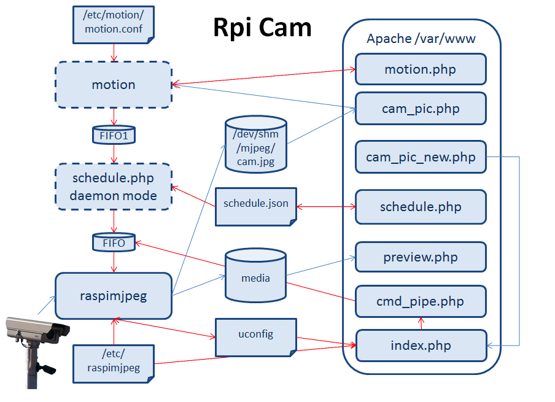

# PI_Camera_Interface
Web based interface for controlling the Raspberry Pi Camera, includes motion detection, time lapse, and image and video recording.
This is an adapted version of [RPI_CAMERA_INTERFACE](https://elinux.org/RPi-Cam-Web-Interface) for our platform for the project [VR-TELE](https://github.com/ZhekaiJin/VR-TELE). 

## Build ##

```shell
git clone https://github.com/zhekaijin/PI_Camera_Interface.git
cd RPi_Cam_Web_Interface
./install.sh
```
## Block Diagram ##


## Full Documentation ##
[RPI Camera Inteface](https://elinux.org/RPi-Cam-Web-Interface)


